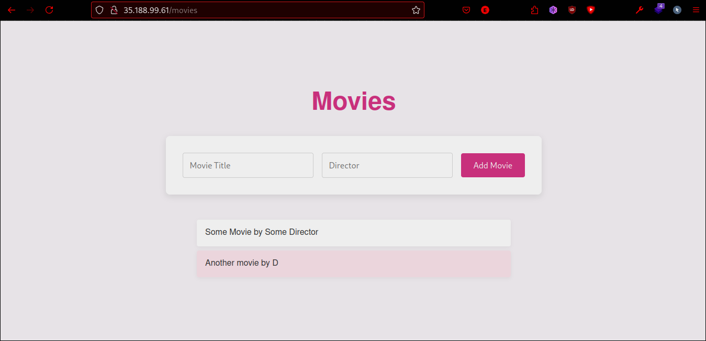
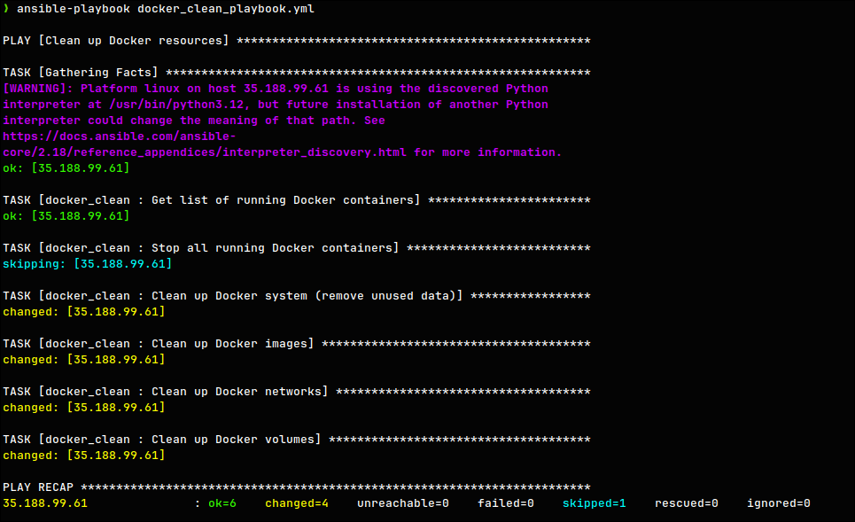
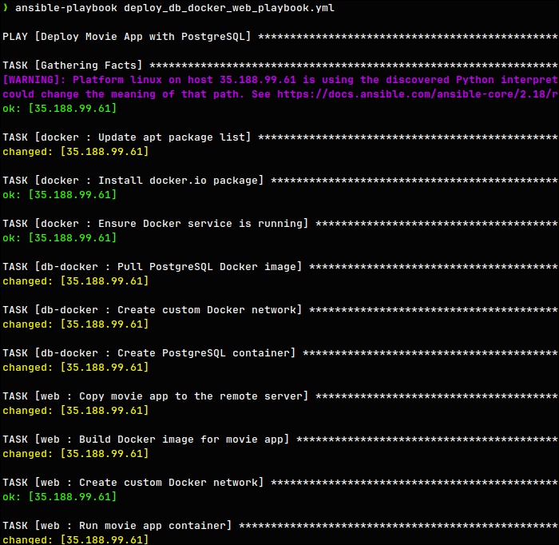
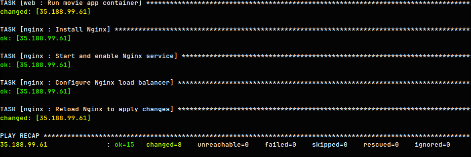
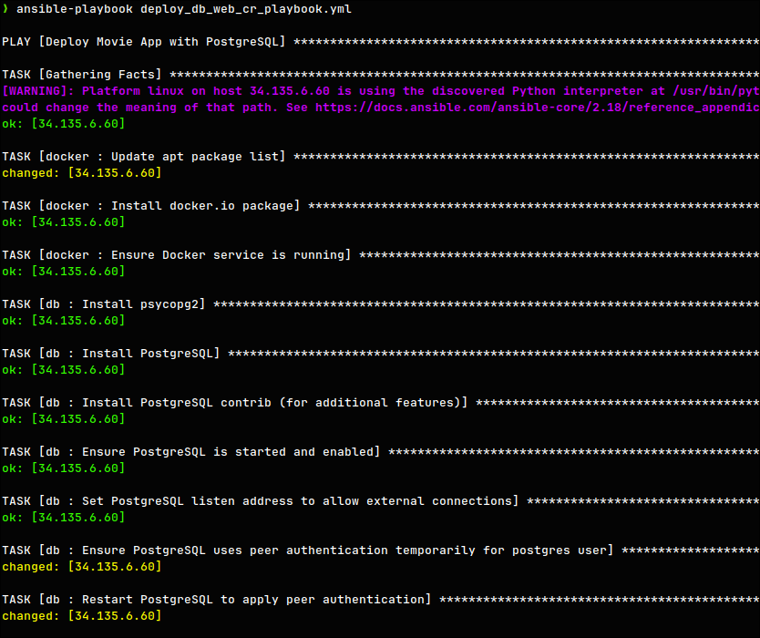
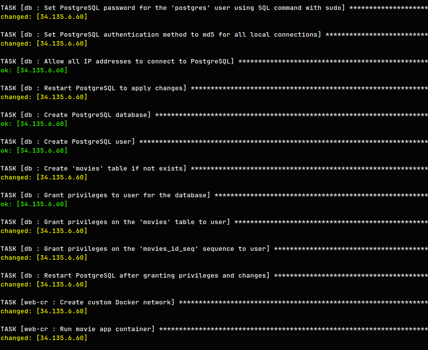
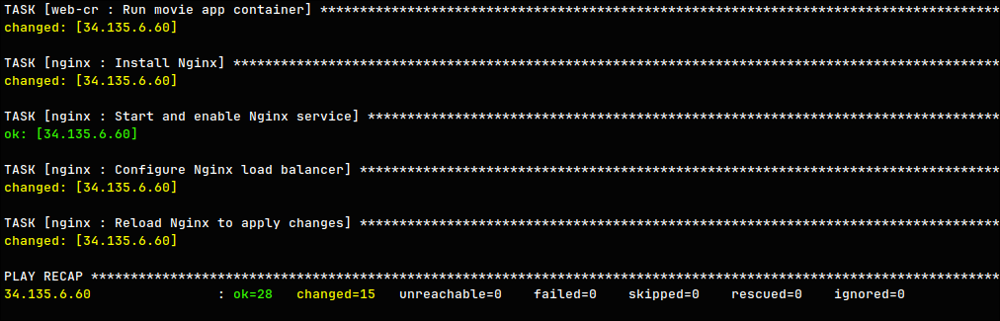

# Ansible Configurations

This documentation provides an overview of the Ansible configuration for deploying a web app and database using Docker, with roles, playbooks, and vaults.

## Project Tree

```bash
ansible-playbooks
├── ansible.cfg
├── deploy_db_docker_web_cr_playbook.yml
├── deploy_db_docker_web_playbook.yml
├── deploy_db_web_cr_playbook.yml
├── deploy_db_web_playbook.yml
├── docker_clean_playbook.yml
├── inventory
├── README.MD
├── roles
│   ├── db
│   │   ├── tasks
│   │   │   └── main.yml
│   │   └── vars
│   │       └── main.yml
│   ├── db-docker
│   │   └── tasks
│   │       └── main.yml
│   ├── docker
│   │   ├── tasks
│   │   │   └── main.yml
│   │   └── vars
│   │       └── main.yml
│   ├── docker_clean
│   │   └── tasks
│   │       └── main.yml
│   ├── nginx
│   │   ├── tasks
│   │   │   └── main.yml
│   │   ├── templates
│   │   │   └── nginx.conf.j2
│   │   └── vars
│   │       └── main.yml
│   ├── web
│   │   └── tasks
│   │       └── main.yml
│   └── web-cr
│       └── tasks
│           └── main.yml
└── vault
    ├── db_password.yml
    ├── sudo_password.yml
    └── vault-password.txt
```

## Inventory

Replace `<IP>` with the actual server IP.

```ini
[web]
<IP> ansible_ssh_user=devops ansible_ssh_private_key_file=~/.ssh/id_rsa

[all:vars]
ansible_become=True
```

## Ansible Config

This configuration simplifies deployment by automating vault decryption and reducing manual intervention with host key checks.

```ini
[defaults]
inventory = inventory
host_key_checking = False
vault_password_file = vault/vault-password.txt
deprecation_warnings=False
```

## Vault

Vault is used to encrypt credentials used in the Playbooks. `db_password.yml` stores gredentials for the Database, and `sudo_password.yml` holds become password. `vault-password.txt` will hold the Vault credentials, do not forget to specify it.

```bash
vault
├── db_password.yml
├── sudo_password.yml
└── vault-password.txt
```

`vault/db_password.yml`

```yml
db_password: "somepass"
db_user: "someuser"
db_name: "moviedb"
```

`vault/sudo_password.yml`

```yml
ansible_become_password: somepass
```

## Roles

There are multiple Roles that are used in deployment and consequently playbooks vary by using the Roles.

### Docker Installation

The `docker` role handles the installation and configuration of Docker on the target hosts.

#### Tasks

1. **Update apt package list**  
   Updates the system's apt cache to ensure the latest package versions are available.

2. **Install Docker**  
   Installs the Docker package (`docker.io` by default, configurable via vars).

3. **Ensure Docker Service is Running**  
   Starts and enables the Docker service to ensure it runs on boot.

#### Variables

- `docker_package`: Defines the Docker package to be installed. Defaults to `docker.io`.

### Database

#### Via Docker

The `db-docker` role is responsible for deploying a PostgreSQL database inside a Docker container.

##### Tasks

1. **Pull PostgreSQL Image**  
   Downloads the latest `postgres` image from Docker Hub.

2. **Create Custom Docker Network**  
   Sets up a dedicated Docker network (`movie_app_network`) for container communication.

3. **Create PostgreSQL Container**  
   Starts the PostgreSQL container with custom environment variables for database name, user, and password, and maps the host port `5432` to the container port. Also, mounts a volume for database initialization scripts.

---

#### Direct on Host

The `db` role installs and configures PostgreSQL directly on the target machine.

##### Tasks

1. **Install Dependencies**  
   Installs `psycopg2`, PostgreSQL, and its contrib package.

2. **Configure PostgreSQL**  
   - Adjusts `postgresql.conf` to listen on all addresses.
   - Updates `pg_hba.conf` to allow connections and sets authentication to `md5`.
   - Sets the password for the `postgres` user.

3. **Database and User Setup**  
   Creates the database and user with appropriate privileges.

4. **Create and Grant Privileges on Tables**  
   - Grants privileges on the `movies` table and its sequence.
   - Creates the `movies` table if it doesn't exist.

5. **Ensure Service Running**  
   Starts and enables the PostgreSQL service to apply changes.

### Web App Deployment

#### Via Building it on the Remote Machine

The `web` role handles building and deploying the web app directly on the target machine.

##### Tasks

1. **Copy Movie App to Remote**  
   Transfers the app source code to the remote server under `/home/devops/movie-app/`.

2. **Build Docker Image for Movie App**  
   Builds a Docker image for the web app from the copied source code.

3. **Create Custom Docker Network**  
   Ensures that the `movie_app_network` exists for container communication.

4. **Run Movie App Container**  
   Runs the web app container, exposing port `3000` and setting the necessary environment variables for database connectivity.

---

#### Via Pulling from Remote Container Registry (Partially Bonus)

The `web-cr` role deploys the web app by pulling a pre-built image from a remote container registry.

##### Tasks

1. **Create Custom Docker Network**  
   Ensures the `movie_app_network` is present.

2. **Run Movie App Container**  
   Pulls the web app image (`jamilays/movie:v3`) from a remote registry, then starts the container, exposing port `3000` and configuring the database connection via environment variables.

### Nginx Configuration (Bonus)

The `nginx` role installs and configures Nginx as a reverse proxy for the web app.

#### Tasks

1. **Install Nginx**  
   Installs the Nginx package on the target machine.

2. **Start and Enable Nginx**  
   Ensures that the Nginx service is running and enabled to start on boot.

3. **Configure Nginx Load Balancer**  
   Copies the custom Nginx configuration file (`nginx.conf.j2`) to the appropriate location, configuring Nginx to act as a reverse proxy to the web app.

4. **Reload Nginx**  
   Reloads the Nginx service to apply the new configuration.

#### Template (`nginx.conf.j2`)

This template configures Nginx to:

- Listen on port `{{ nginx_listen_port }}` (default: 80).
- Proxy requests to the web app running on `localhost:{{ nginx_proxy_port }}` (default: 3000).
- Set appropriate headers for forwarding requests.

### Docker Clean (Used During Development)

The `docker_clean` role is used to clean up Docker resources during development by stopping containers and removing unused Docker data.

#### Tasks

1. **Get List of Running Docker Containers**  
   Retrieves a list of running Docker containers using `docker ps -q`.

2. **Stop All Running Docker Containers**  
   Stops all running containers if any are found.

3. **Clean Up Docker System**  
   Removes unused Docker data (`docker system prune -f`), including stopped containers and unused networks.

4. **Clean Up Docker Images**  
   Removes all unused Docker images (`docker image prune -a -f`).

5. **Clean Up Docker Networks**  
   Prunes unused Docker networks (`docker network prune -f`).

6. **Clean Up Docker Volumes**  
   Prunes unused Docker volumes (`docker volume prune -a -f`).

## Playbooks

Here is a summary of the provided playbooks, which deploy the Movie App with PostgreSQL using various configurations and clean up Docker resources during development.

### `deploy_db_docker_web_cr_playbook.yml`

- Deploys the Movie App and PostgreSQL database using Docker for both components.
- The web app is pulled from a remote container registry (`web-cr` role).
- Roles:
  - `docker`, `db-docker`, `web-cr`, `nginx`
  
### `deploy_db_docker_web_playbook.yml`

- Deploys the Movie App and PostgreSQL database using Docker.
- The web app is built directly on the remote server (`web` role).
- Roles:
  - `docker`, `db-docker`, `web`, `nginx`

### `deploy_db_web_cr_playbook.yml`

- Deploys the Movie App and PostgreSQL database directly on the host.
- The web app is pulled from a remote container registry (`web-cr` role).
- PostgreSQL is installed directly on the host (`db` role).
- Roles:
  - `docker`, `db`, `web-cr`, `nginx`

### `deploy_db_web_playbook.yml`

- Deploys the Movie App and PostgreSQL database directly on the host.
- The web app is built directly on the remote server (`web` role).
- Roles:
  - `docker`, `db`, `web`, `nginx`

### `docker_clean_playbook.yml`

- Cleans up Docker resources during development.
- Stops running containers and prunes unused images, networks, and volumes.
- Roles:
  - `docker_clean`

## Run the Ansible Playbooks

To run the Ansible playbooks, follow these steps:

1. **Check the Ansible Configuration**  
   Ensure that your `ansible.cfg`, `vault/*` and `inventory` files are properly set up. The playbooks reference `vault` files for secure credentials.

2. **Decrypt Vault (Optional)**  
   If your vault uses encryption, ensure the correct vault password file is in place:

   ```bash
   ansible-vault decrypt vault/db_password.yml
   ansible-vault decrypt vault/sudo_password.yml
   ```

3. **Run the Playbook**  
   Use the `ansible-playbook` command to run any of the playbooks. For example:

   - **Deploy App with Docker and Remote Container Registry**  

     ```bash
     ansible-playbook deploy_db_docker_web_cr_playbook.yml
     ```

   - **Deploy App with Docker and Build Locally**  

     ```bash
     ansible-playbook deploy_db_docker_web_playbook.yml
     ```

   - **Deploy App Directly on Host with Remote Container Registry**  

     ```bash
     ansible-playbook deploy_db_web_cr_playbook.yml
     ```

   - **Deploy App Directly on Host and Build Locally**  

     ```bash
     ansible-playbook deploy_db_web_playbook.yml
     ```

   - **Clean Up Docker Resources**  

     ```bash
     ansible-playbook docker_clean_playbook.yml
     ```

4. **Check Deployment Status**  
   After running the playbooks, you can check if the containers and services are running:

   ```bash
   docker ps
   systemctl status nginx
   systemctl status postgresql
   ```

Make sure you have appropriate SSH access and permissions to run the playbooks on the target hosts.

### Testing and Ensuring Everything Works

1. **Check Docker Containers**:

```bash
docker ps
```

- Ensure `movie-app` and PostgreSQL containers are running. Use `docker logs <container_id>` if needed.

2. **Check Web App**:

- Access in browser:

```bash
http://<server_ip>:3000
http://<server_ip>
```

- Or use `curl`:

```bash
curl http://<server_ip>:3000
curl http://<server_ip>:80
```

3. **Verify Nginx Configuration**:

```bash
sudo nginx -t
sudo systemctl reload nginx
```

4. **Test Database Connection**:

- For Docker DB:

```bash
docker exec -it <db_container_id> psql -U postgres
```

- Ensure `DATABASE_URL` is set correctly.

5. **Verify Database**:

```bash
SELECT * FROM movies;
```

6. **Check Docker Cleanup**:

```bash
docker system df
```

7. **Check Logs**:

- **Nginx**:

```bash
sudo tail -f /var/log/nginx/error.log
```

- **Web App**:

```bash
docker logs <movie-app_container_id>
```

- **PostgreSQL**:

```bash
docker logs <postgres_container_id>
systemctl status postgresql
```

8. **Test Idempotence**:
Re-run the playbook:

```bash
ansible-playbook deploy_db_docker_web_cr_playbook.yml
```

This ensures your app is deployed correctly and running. Additionally, You can use the following bash script: `check_deployment.sh` that automates the process:

```bash
chmod +x check_deployment.sh
./check_deployment.sh
```

## The Proof that every Playbook works

### Deployed Web App



### Running Playbooks

- `docker_clean_playbook.yml`



- `deploy_db_docker_web_playbook.yml` - DB in Docker and Web App built on machine.




- `deploy_db_web_cr_playbook.yml` - DB on host and Web App from Container Registry.





There is no need to check other two playbooks, as all roles are covered in those three.
