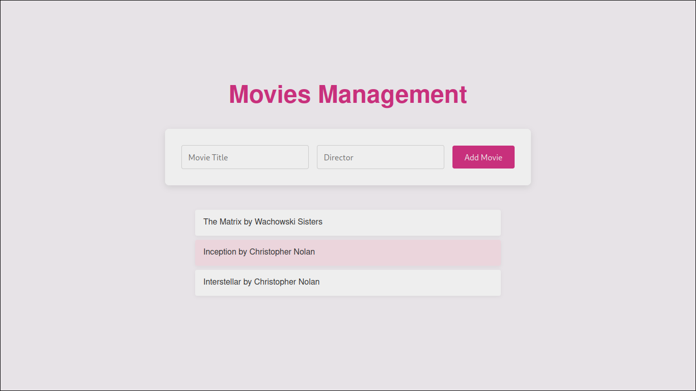

# Movie App

## Purpose

This app allows adding Movies to the List.



## Tech Stack

- Web App - NodeJS
- Database Backend - Postgresql

## Project Tree

```bash
movie-app
├── app.js
├── docker-compose.yml
├── Dockerfile
├── init-db
│   └── init.sql
├── models
│   └── movie.js
├── package-lock.json
├── package.json
├── README.MD
├── routes
│   └── movieRoutes.js
└── views
    └── index.ejs
```

## Functionality

The app provides basic CRUD operations for managing movies in a database. It connects to the database using a URI and credentials. Initialization SQL scripts (init.sql) are executed automatically via Docker Compose or Ansible to set up the database.

## Dockerization

### Dockerfile

The Dockerfile is used to containerize the app:

```dockerfile
# Use official Node.js image
FROM node:16

# Set working directory
WORKDIR /usr/src/app

# Copy package.json and install dependencies
COPY package*.json ./
RUN npm install

# Copy all files to the container
COPY . .

# Expose port
EXPOSE 3000

# Start the app
CMD ["node", "app.js"]
```

### Docker Compose

The docker-compose.yml file sets up both the web app and PostgreSQL database:

```yml
version: '3'
services:
  web:
    build: .
    ports:
      - "3000:3000"
    environment:
      - DATABASE_URL=postgres://user:password@db:5432/moviedb
    depends_on:
      - db
  db:
    image: postgres:latest
    environment:
      - POSTGRES_USER=user
      - POSTGRES_PASSWORD=password
      - POSTGRES_DB=moviedb
    ports:
      - "5432:5432"
    volumes:
      - ./init-db:/docker-entrypoint-initdb.d # initial SQL
```

### Container Registry (Partially The Bonus)

Additionally, the built web app image can be tagged and pushed container registry

```bash
docker tag movie-app-web:latest jamilays/movie-app:v1
docker push jamilays/movie-app:v1
```

This image can be used in further deployment steps (e.g., with Ansible).

## Usage

### Local Machine

```bash
cd movie-app
docker compose up -d
```

### Via Ansible on Remote Machine

Refer to the Ansible documentation for deployment steps.

- [ansible](../ansible/ansible.md)
